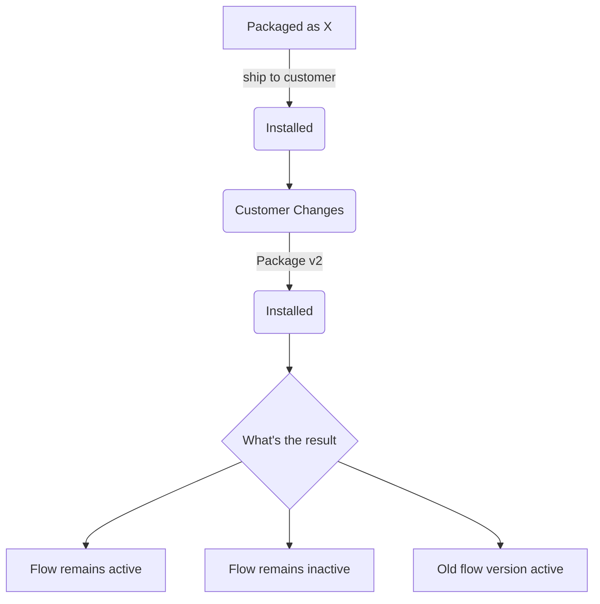

# Flownarios

- [Flownarios](#flownarios)
  - [Generating Flows](#generating-flows)
  - [Flownario Navigator](#flownario-navigator)
  - [Building the Managed Package](#building-the-managed-package)
    - [Prepping the Files](#prepping-the-files)
      - [Create Flownario Combinations](#create-flownario-combinations)
      - [Create the Flow Files](#create-the-flow-files)
    - [Creating the Managed Package](#creating-the-managed-package)
    - [Creating and Working in Subscriber Org](#creating-and-working-in-subscriber-org)
    - [Package v2](#package-v2)
  - [Packages](#packages)


Goal of this repo is to test a variety of flow packaging scenarios (flownarios) to create a comprehensive guide that illustrates the impact of subscriber and partner packaged changes. At a very high level:



## Generating Flows

While we could generate Flows for each scenario by hand, that'd be an exercise in tedium that could be avoided. Instead, the project starts by identifying different inputs at various stages. For this version of Flownarios, three distinct stages were identified: packageV1, customer changes, and packageV2. Within each stage, a number of inputs are identified along with their potential values. For example, version 1 of the package may have a status of Active or Inactive.

```js
{ v1Status: ["Active","Inactive"]};
```

These inputs are defined and captured in `scripts/flownarios.js` as `const flownarioInputs`.

With the inputs and variants set, a list of combinations generated with the `generateCombinations(...objects)`. This function produces a full list of scenarios while excluding invalid scenarios such as the customer overriding a non-overrideable flow.


Run `npm run createFlows` to generate flow metadata files out of CSV inputs. Flows will be created with a seven character substring of Hash serving as the name. This is done to ensure consistent naming across versions.

Running `npm run eraseFlows` will delete the local copies of flows and allow you to regenerate them if necessary. 

---


These inputs are used to dynamically generate Flow metadata files using the `createFlows.js` script. Care is taken in `createFlows` to avoid impossible scenarios within a flow. For example, a Flow Template cannot have customer changes made as if it were an overrideable.


SELECT Id, DurableId, ApiName, Label, IsActive, ActiveVersionId, Description, ProcessType, TriggerType, NamespacePrefix, VersionNumber, ApiVersion from FlowDefinitionView WHERE NamespacePrefix='mvpbo'

// retrieves all versions of flows for a given namespace
"SELECT Id, DurableId, FlowDefinitionViewId, Label, Description, Status, VersionNumber, ApiVersion, LastModifiedDate FROM FlowVersionView WHERE FlowDefinitionView.NamespacePrefix='mvpbo' ORDER BY Label, VersionNumber"

## Flownario Navigator

To view Flownario Navigator, run `npm run launchNavigator` which will create a local http server to deliver the page.


## Building the Managed Package

### Prepping the Files

#### Create Flownario Combinations

This creates the initial version of the `flownarioData.js` file which will drive and be updated by subsequent operations. Backups of any existing `flownarioData.js` file are saved to the `backup` directory and postfixed with the timestamp.

`npm run createCombinations`

```js
const scenarios = [
  {
    "v1State": "Active",
    "v1Type": "screen flow",
    "v1TempOver": "template",
    "ccState": "deactivates",
    "ccOverride": "none",
    "v2Metadata": "change",
    "v2State": "Active",
    "v2ApiVersion": "same",
    "hash": "5lx95",
    "pkgV1DeployedState": {
      "activeVersion": "1",
      "apiVersion": "58.0",
      "description": "v1State: Active\nv1Type: screen flow\nv1TempOver: template\nccState: deactivates\nccOverride: none\nv2Metadata: change\nv2State: Active\nv2ApiVersion: same\nhash: 5lx95\nflowName: flownarios_0_5lx95",
      "status": "Active",
      "totalVersions": 1
    },
    "customerChangesState": {
      "activeVersion": "",
      "apiVersion": "",
      "description": "",
      "status": "",
      "totalVersions": ""
    },
    "pkgV2DeployedState": {
      "activeVersion": "",
      "apiVersion": "",
      "description": "",
      "status": "",
      "totalVersions": ""
    },
    "flowName": "flownarios_0_5lx95"
  },
  {...}
];
export default scenarios;
```

#### Create the Flow Files

Creates the flow xml files based on the `flowTemplate.xml` file and data from `flownarioData.js`.

`npm run createFlows`

### Creating the Managed Package

Creates the initial package and returns an `0Ho` id (`0HoHs000000blgwKAA`)

`sf package create -n flownarios -v pboDevHub -d "A collection of flow scenarios, flownarios, meant for testing outcomes between package version deployments." -r force-app/main/default -t Managed`

Creates the first package version and returns a `04t` id (`04tHs000000Bs2GIAS`, install url: https://login.salesforce.com/packaging/installPackage.apexp?p0=04tHs000000Bs2GIAS)

`sf package version create -v pboDevHub -k password123 -w 10 --code-coverage -p {0Ho}`

Promotes the package from Beta to Released

`sf package version promote -p {04t}`

### Creating and Working in Subscriber Org

Create a subscriber org and set your target-org to the subscriber org

`sf org create scratch -f config/project-scratch-def.json -a flownarioSubscriber -v pboDevHub -w 10 -y 21`

`sf config set target-org=flownarioSubscriber`

Install the package into the subscriber org 

`sf package install -k password123 -w 10 -p {04t v1}`

Before making any changes, query the subscriber org to gather information about the deployed flows. This data will feed into the `pkgV1DeployedState` key within `flownarioData.js` for each flow.

`npm run flownarioQueryV1`

Go into the org and make customer changes as specified in flownarioData.js. You SHOULD NOT be editing the flownarioData.js file.

For flows that will be overridden or templates used, copy the existing filename and append with "_template" or "_override"

`sf org open`

Once all subscriber org changes are complete, query the org to gather information about the flows. This step allows you to avoid the manual data entry would otherwise be required.

`npm run flownarioQueryCustomer`

### Package v2

Apply metadata changes to flow files that reflect the desired updates in `flownarioData.js`

`npm run updateFlows`

MAKE METADATA CHANGES
`sf package version create -v pboDevHub -k password123 -w 10 -p 0HoHs000000blgwKAA  --code-coverage`
`sf package version promote -p {04t}`

`sf package install -k password123 -w 10 -p {04t v2}`
Deploys package version v2 to the subscriber org.

`npm run flownarioQueryV2`
Queries the subscriber org and updates flownarioData.js with information regarding the v2 deployment and its impact on the subscriber org. After running this command, the flownarioData.json is complete and you can start exploring the results with Flownario Navigator.

`npm run launchNavigator`
Creates a local http server to serve up the flownarios.html page. The local http server is needed to get around CORS limitations that would rear its head if just opening the file directly in your browser. 

## Packages

|Package Version Id|Description|
|---|---|
|04tHs000000Bs2GIAS|Aligns with pkg v1 and has correct metadata for flows 0-160|
|04tHs000000BsmoIAC|Aligns with pkg v1 and has correct metadata for flows 0-319|
