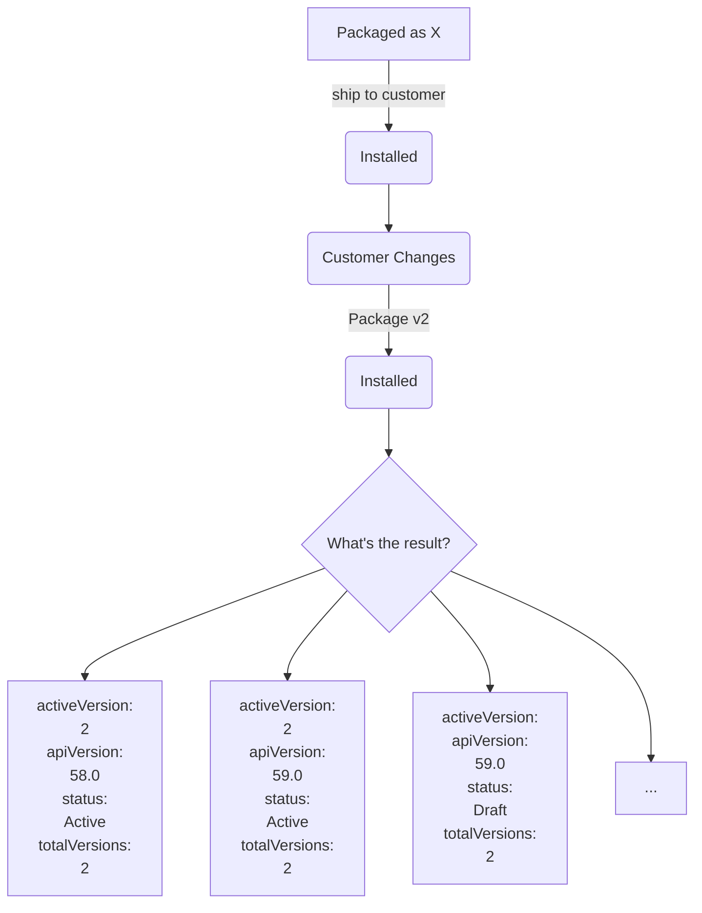

# Flownarios

- [Flownarios](#flownarios)
  - [About](#about)
    - [Results](#results)
    - [Deploying and Observing Behavior](#deploying-and-observing-behavior)
  - [Running the Experiment](#running-the-experiment)
    - [Creating Combinations](#creating-combinations)
    - [Creating Flow Files](#creating-flow-files)
    - [Creating Managed Package](#creating-managed-package)
    - [Creating the Managed Package](#creating-the-managed-package)
    - [Creating and Deploying to Subscriber Org](#creating-and-deploying-to-subscriber-org)
    - [Making Customer Changes](#making-customer-changes)
    - [Package v2](#package-v2)
      - [Create and Install Package Version 2](#create-and-install-package-version-2)

## About

The goal of this repo is to test a variety of flow packaging scenarios (flownarios) to create a comprehensive guide that illustrates the impact of subscriber and partner packaged changes. At a very high level:



### Results

To view results of this analysis, you can go to [https://mvogelgesang.github.io/flownarios/](https://mvogelgesang.github.io/flownarios/). Or, if you are running this locally, `npm run launchNavigator`. On the flownarios site, you can specify different inputs and customer changes to see how they affect subsequent packaged deployments. Certain scenarios were not tested (pkgV1 deployed as Active, customer cannot then Activate the flow) and you will be notified when zero potential scenarios remain.

URL params are updated as you select options which allows for link sharing to view specific results.

### Deploying and Observing Behavior

The 320 flownarios are captured in a managed package which allows folks to install and observe behaviors between package version 1 and version 2. This is valuable if you'd like to test the effect of customer changes and need a ready supply of flow types from which to start.

|Package Version Id|Description|Install command|
|---|---|---|
|04tHs000000Bt3oIAC|Pkg v1|`sf package install -k password123 -w 10 -p 04tHs000000Bt3oIAC -o {YOUR ORG ALIAS}`|
|04tHs000000BtjLIAS|Pkg v2|`sf package install -k password123 -w 10 -p 04tHs000000BtjLIAS -o {YOUR ORG ALIAS}`|

## Running the Experiment

The process to generate the flow metadata files in their various forms could not have been done without scripting. This portion of the README aims to explain the process and steps by which the flownarios were created and could be extended in the future.

### Creating Combinations

For this version of Flownarios, three distinct stages were identified: packageV1, customer changes, and packageV2. Within each stage, a number of inputs are identified along with their potential values. For example, version 1 of the package may have a flow with a status of Active or Inactive. For each input, we create an array of potential values.

```js
{ v1Status: ["Active","Draft"]};
```

These inputs are defined and captured in `scripts/flownarios-client.js` as `const flownarioInputs`.

With the inputs and potential values identified, combinations are generated via the `npm run createCombinations` command. Within `createCombinations` impossible scenarios are excluded from the final result. For example, a customer overriding a non-overrideable flow. The results of this command are saved to `flownarioData.js` and available as a named export. This creates the initial version of the `flownarioData.js` file which will drive and be updated by subsequent operations. Backups of any existing `flownarioData.js` file are saved to the `backup` directory and postfixed with the timestamp.

```js
// flownarioData.js
const scenarios = [
  {
    "v1State": "Active",
    "v1Type": "screen flow",
    "v1TempOver": "template",
    "ccState": "deactivates",
    "ccOverride": "none",
    "v2Metadata": "change",
    "v2State": "Active",
    "v2ApiVersion": "same",
    "hash": "5lx95",
    "pkgV1DeployedState": {
      "activeVersion": "1",
      "apiVersion": "58.0",
      "description": "v1State: Active\nv1Type: screen flow\nv1TempOver: template\nccState: deactivates\nccOverride: none\nv2Metadata: change\nv2State: Active\nv2ApiVersion: same\nhash: 5lx95\nflowName: flownarios_0_5lx95",
      "status": "Active",
      "totalVersions": 1
    },
    "customerChangesState": {
      "activeVersion": "",
      "apiVersion": "",
      "description": "",
      "status": "",
      "totalVersions": ""
    },
    "pkgV2DeployedState": {
      "activeVersion": "",
      "apiVersion": "",
      "description": "",
      "status": "",
      "totalVersions": ""
    },
    "flowName": "flownarios_0_5lx95"
  },
  {...}
];
export default scenarios;
```

### Creating Flow Files

`npm run createFlows`

Creates the flow xml files based on the `flowTemplate.xml` file and data from `flownarioData.js`. A seven character hash is created using the values from each input. This is done so the experiment can be run by different users and flow `8u6zp8` will be the same across machines.

If necessary, running `npm run eraseFlows` will delete the local copies of flows.

### Creating Managed Package

### Creating the Managed Package

Creates the initial package and returns an `0Ho` id

`sf package create -n flownarios -v pboDevHub -d "A collection of flow scenarios, flownarios, meant for testing outcomes between package version deployments." -r force-app/main/default -t Managed`

Creates the first package version and returns a `04t` id.

`sf package version create -v pboDevHub -k password123 -w 10 --code-coverage -p {0Ho}`

Promotes the package from Beta to Released. This is v1.

`sf package version promote -p {04t}`

### Creating and Deploying to Subscriber Org

Create a subscriber org and set your target-org to the subscriber org

`sf org create scratch -f config/project-scratch-def.json -a flownarioSubscriber -v pboDevHub -w 10 -y 21`

`sf config set target-org=flownarioSubscriber`

Install the package into the subscriber org

`sf package install -k password123 -w 10 -p {04t v1}`

Before making any changes, query the subscriber org to gather information about the deployed flows. This data will feed into the `pkgV1DeployedState` key within `flownarioData.js` for each flow.

`npm run flownarioQueryV1`

### Making Customer Changes

`sf org open -o flownarioSubscriber`

Go into the org and make customer changes as specified in `flownarioData.js`. You SHOULD NOT be editing the `flownarioData.js` file.

When overriding flows or using templates, Save As a new flow and append "_template" or "_overrideable" to the flow name.

Once all subscriber org changes are complete, query the org to gather information about the flows in their current stat. This step allows you to avoid the manual data entry would otherwise be required.

`npm run flownarioQueryCustomer`

This updates `flownarioData.js` and updates contents of the `customerChangesState` key.

Commit changes to repository

`git add scripts/*.json scripts/*.js`
`git commit -m "customer changes complete`

### Package v2

`npm run updateFlows`

Applies metadata changes to flow files that reflect the desired updates in `flownarioData.js`

Not all flows will be updated. This is to reflect scenarios where there is no change to a flow from pkgV1 to pkgV2.

#### Create and Install Package Version 2

Update sfdx-project.json and increment the minor version number by 1.

```diff
-"versionNumber": "2.1.0.NEXT",
+"versionNumber": "2.2.0.NEXT",
```

`sf package version create -v pboDevHub -k password123 -w 10 -p {0Ho} --code-coverage`

`sf package version promote -p {04t}`

`sf package install -k password123 -w 10 -p {04t v2}`

Deploys package version v2 to the subscriber org.

`npm run flownarioQueryV2`

Queries the subscriber org and updates flownarioData.js with information regarding the v2 deployment and its impact on the subscriber org. After running this command, the flownarioData.json is complete and you can start exploring the results with Flownario Navigator.

`npm run launchNavigator`

Creates a local http server to serve up the flownarios.html page. The local http server is needed to get around CORS limitations that would rear its head if just opening the file directly in your browser.
